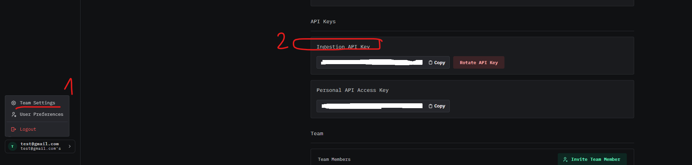
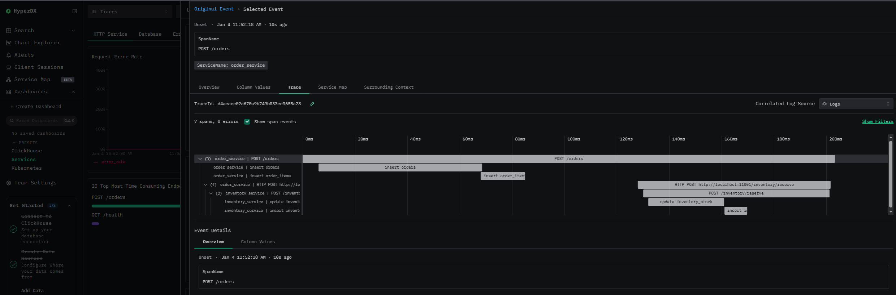

# Let's Observe

**Let's Observe** is a side project where I explore **ClickStack** as an **APM (Application Performance Monitoring)** solution by building and observing a set of **microservices**.

The goal of this project is to understand how tracing, metrics, and logs work together in a real microservice environment, and how ClickStack can be used to gain visibility into system behavior and performance.

---

## 🎯 Project Goals

- Explore **ClickStack** as an APM tool
- Practice setting up **distributed tracing** with OpenTelemetry
- Observe **metrics, logs, and traces** across microservices
- Understand common APM challenges in real systems:
  - Latency
  - Errors
  - Bottlenecks
  - Service dependencies

---

## 🧰 Tech Stack

- **Language**: Go
- **APM**: ClickStack
- **Observability**: OpenTelemetry
- **Databases**: PostgreSQL (or your actual DB)
- **Transport**: HTTP / REST
- **Containerization**: Docker, Docker Compose
- **Telemetry Backend**: ClickHouse (via ClickStack)

## Quick start
1. Fill .env config
```bash
cp .env.example .env
```

2. Setup local lab: it spawn postgresql DB, Clickstack also migrate db schemas.
```bash
make setup
```

3. Feed seeds data
```bash
make feed
```

4. Get Ingestion API Key (via HyperDX UI at [localhost:8080](http://localhost:8080))



```bash
# Update key to env 
APM_API_KEY=<your_ingest_api_key>
```

5. Start app
```bash
# start order app
go run cmd/orders/main.go
```

```bash
# start inventory app
go run cmd/inventory/main.go
```

6. Test place order api
```bash
curl --location 'localhost:11000/orders' \
--header 'Content-Type: application/json' \
--data '{
    "items": [
        {
            "product_id": "<Replace_product_id_get_from_DB>",
            "product_name": "Wireless Mouse",
            "quantity": 2,
            "unit_price": 49.50
        }
    ],
    "money": 99,
    "shipping_address": "123 Example Street",
    "shipping_phone": "+84123456789",
    "userID": "550e8400-e29b-41d4-a716-446655440000"
}'
```

**Result**
